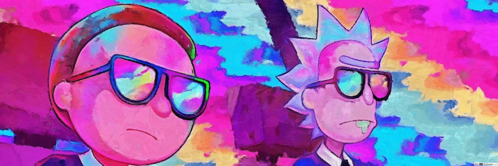

## >☕ Hi, I'm Parsa Sajedi
- 🎓  Computer Engineering Student At Shahid Chamran University
- 👨‍💻  I’m currently working on Django Project
- 📖  I’m currently learning Iot and Django
- 💬 Ask me about Embedded systems
- 📫 How to reach me: [Telegram](https://t.me/young_ice), [Email](https://www.gmail.com/parsasajedi2002@gmail.com)

## Skills</>
&nbsp;
&nbsp;
&nbsp;
&nbsp;
&nbsp;
&nbsp;
&nbsp;
&nbsp;

## Experience 🔧
&nbsp;
&nbsp;
&nbsp;
&nbsp;
&nbsp;
&nbsp;

##  **Stats**

<table align="center">
    <tr>
        <td align="center">
            
        </td>
        <td align="center">
            
        </td>
    </tr>
</table>

  

